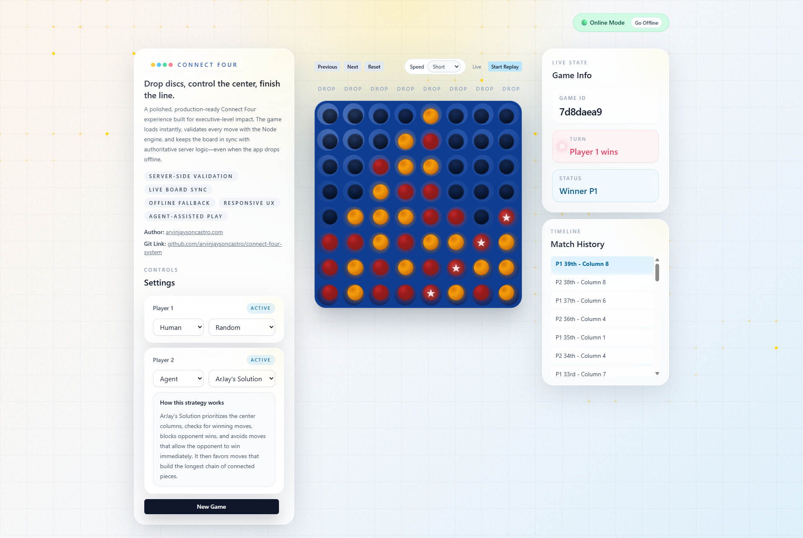
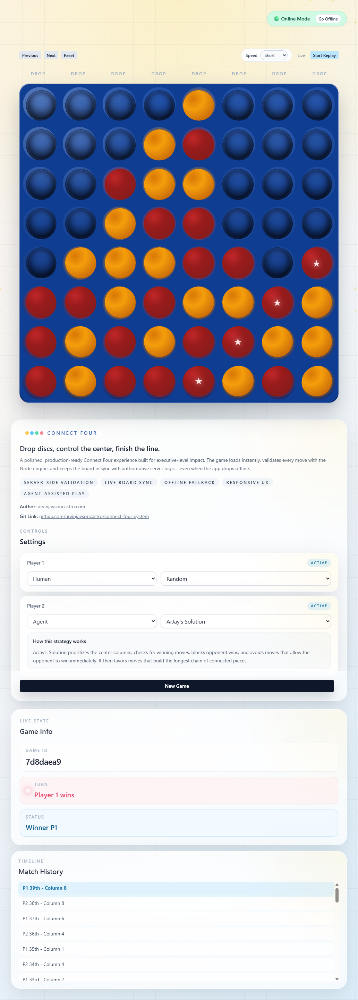
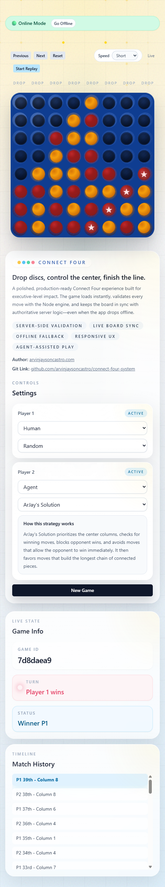

# Connect Four System — Production Overview

Live Demo: [https://connect-four-system.vercel.app](https://connect-four-system.vercel.app)

## Executive Summary
A production-ready Connect Four platform designed with resilience, system clarity, and user-first experience.

The system is architected to operate under infrastructure constraints (e.g., cold starts) by implementing a dual-mode execution strategy:
- Online Mode (backend-driven)
- Offline Mode (frontend-driven fallback)

This ensures uninterrupted gameplay regardless of backend availability.

---

## System Highlights
- Dual-mode gameplay (online/offline)
- Health-aware backend detection
- Local-first fallback using browser storage
- Scalable frontend/backend separation
- Clean architecture with TypeScript across stack

---

## UI System (Responsive Design)

### Desktop UI

### Tablet UI

### Mobile UI

---

## Architecture Overview
- Frontend: Next.js (App Router, TypeScript)
- Backend: Node.js (Express)
- Deployment: Vercel (FE), Render (BE)
- Storage (Offline): localStorage

---

## Linked Documentation
- [Web Documentation](./README.WEB.md)
- [API Documentation](./README.API.md)

---

## CTO Notes
This system demonstrates:
- Resilience-first design
- Clear separation of concerns
- UX-driven engineering decisions
- Production-ready thinking under constraints

